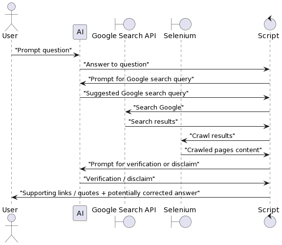

# Go-to-the-source! (towards accountable LLMs)

*Note: this project was made when ChatGPT was new and the only game in town. Quickly after that, a lot of new LLMs with different capabilities appeared...*
*Note II: I learned recently that what I implemented here is similar to something called the ReAct pattern, see [https://til.simonwillison.net/llms/python-react-pattern?s=03](this link)*
Let's make LLMs accountable! They are usally trapped in a cage without Internet connection, but we can provide them with what they need to support their claims. Given a claim, we are going to make them search Google until they find a source that supports it! Because we are whole-hearted, we are then also going to give them the chance to either confirm or dismiss what they said, and instead provide a different answer.

To try this prototype, you will need programmatic access to the Google Search API and the Open AI API. Then, set the following environment variables: `GOOGLE_API_KEY`, `GOOGLE_API_CX`, `OPENAI_KEY`.

You will also need a couple of dependencies installed in your environment (see [requirements.txt](requirements.txt)), as well as Chromium + a compatible chromium driver for Selenium in PATH (I have opted to use Selenium without headless mode to minimize the amount of pages that reject crawling).

Then: `python3 -m go_to_the_source`

## Example:

```
Please input a simple (single-line) prompt that you want to make to GPT-3: When did Antonio Banderas win an oscar?
GPT-3 says: 

Antonio Banderas has not won an Oscar. He has been nominated for one, for his performance in the 1999 film "The Mask of Zorro".
.
.
.
Got it, must visit https://en.wikipedia.org/wiki/List_of_awards_and_nominations_received_by_Antonio_Banderas to confirm your claim!
.
.
.
Yes, confirmed ...
```

To use another LLM other than ChatGPT (only GPT-3), set environment variable `USE_LLM` to `GPT-3`.

## How it works

Basically, it goes as follows:
* We prompt a question to the LLM. The LLM returns an answer.
* We ask the LLM something along the lines: How would you verify this question using Google? So the LLM comes up with a search query for that.
* We send the search query to Google and start fetching the contents of the search results.
* With each crawled page, we ask the LLM if the provided content verifies or contradicts (disclaims) the provided answer, or neither. If the LLM says "neither"; we continue to provide more crawled pages.
* The process finishes when the LLM either confirms or disclaims its answer, or there are no more pages to crawl.



## Future improvements

* Do a comprehensive test to extract some more conclusions. Are there cases where the first answer was right and the reconsidered answer is wrong?
* Improve logging / output. Right now everything is printed including the crawled content, but we might want to have more or less verbose outputs.
